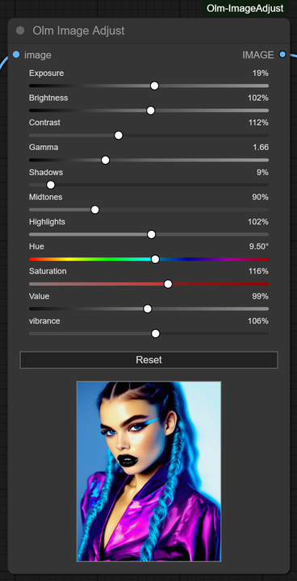

# Olm Image Adjust for ComfyUI



An interactive image adjustment node for ComfyUI, with an easy-to-use graphical interface and realtime preview.

- **Author:** Olli Sorjonen
- **GitHub:** https://github.com/o-l-l-i
- **X:** https://x.com/Olmirad
- **Version:** 1.0.1 (Preview updates)

---

## ✨ What Is This?

**Olm Image Adjust** is a small, standalone, and highly responsive image adjustment node for ComfyUI.
It includes a live preview feature, allowing you to view changes in realtime without re-running the full graph.

Use it for:

- Color grading and stylization
- Fine-tuning exposure, contrast, and gamma
- Quick adjustments before upscaling, masking, or compositing
- Previewing how small tweaks impact an image visually
- Creative use-cases

---

## 🎯 Why Use This?

- 🧩 **Standalone and Focused**
  - This is not part of a bulky node pack.

- ⚡ **Lightweight with Zero Bloat**
  - Uses only core Python libraries: `Pillow`, `NumPy`, and `Torch`.
  - No extras, hidden weights, models, servers or tangled dependencies.

- 🧘 **Stable and Clean UX**
  - Designed for simplicity and responsiveness.

---


## 🎨 Features

### 🎛️ Real-Time Preview
No need to re-run the graph — just adjust sliders and instantly see changes in the UI.

### 🌈 Comprehensive Controls
Includes 11 fine-tuned parameters to adjust image tone, brightness, and color balance:

| Parameter     | Description |
|---------------|-------------|
| **Exposure**  | Adjusts overall light intensity, simulating camera exposure. |
| **Brightness**| Brightens or darkens the image linearly. |
| **Contrast**  | Enhances or reduces the difference between light and dark areas. |
| **Gamma**     | Non-linear adjustment to midtones; great for softening shadows. |
| **Shadows**   | Lifts or deepens the darkest areas. |
| **Midtones**  | Boosts or tones down mid-level brightness ranges. |
| **Highlights**| Adjusts the brightest parts without affecting shadows. |
| **Hue**       | Rotates all colors in the image along the color wheel. |
| **Saturation**| Controls the intensity of colors. |
| **Value**     | Uniform scaling of the HSV "value" channel. |
| **Vibrance**  | Smart saturation boost — enhances muted colors without over-saturating already vivid ones. |

### 🖼️ Integrated Image Preview
A thumbnail in the node shows your updated image so you can see what you're working with instantly.

### 💡 Responsive UI
- Immediate feedback makes it easy to dial in the perfect look without backtracking or guesswork.
- Preview image scales responsively.
- Sliders scale also, so you can scale up the node for more precise tweaks.

---

## 📦 Installation

Clone this repository into your `custom_nodes` folder.

```bash
git clone https://github.com/o-l-l-i/ComfyUI-Olm-ImageAdjust.git
```

Your folder structure should look like this:

```bash
ComfyUI/
└── custom_nodes/
    └── ComfyUI-Olm-ImageAdjust/
        ├── __init__.py
        ├── olm_imageadjust.py
        └── ... (other files)
```

Restart ComfyUI to load the new node.

✅ No extra dependencies needed.

---

## 🧪 Basic Usage
1. Load an image using the Load Image node.
2. Connect it to the Olm Image Adjust node.
3. Run the graph to generate a preview image in the node.
4. Adjust the sliders in the node interface to modify: Exposure, Brightness, Contrast, etc.
5. See the changes in real-time preview inside the node.
6. The output can be used as input to any downstream node that accepts an image.
7. Continue your workflow with the adjusted image (e.g., compositing, prompting with image, upscaling, etc.)

---

## ⚠️ Known Limitations
- The real-time preview only updates once the graph is initially run; after that, adjustments are instant, but the preview only refreshes internally until another execution is triggered (i.e. if you change image, run the graph again.)
- Vibrance is my own interpretation and may produce inconsistent results on edge cases.
- Works best on uncopressed RGB images (as always in image processing.)
- Performance may vary depending on CPU/GPU, image size, and your ComfyUI installation.

---

## 💬 Notes

This extension is experimental and under active development.

Functionality, files, and behavior may change without notice, and compatibility with future updates is not guaranteed. Use at your own risk, especially in workflows.

Back up your projects frequently. Feedback, bug reports, and suggestions are always welcome - but expect breakage, quirks, and rough edges.

This tool does what I need right now; future updates may be irregular depending on available time.

---

## License & Usage Terms

Copyright (c) 2025 Olli Sorjonen

This project is source-available, but not open-source under a standard open-source license, and not freeware.
You may use and experiment with it freely, and any results you create with it are yours to use however you like.

However:

Redistribution, resale, rebranding, or claiming authorship of this code or extension is strictly prohibited without explicit written permission.

Use at your own risk. No warranties or guarantees are provided.

The only official repository for this project is: 👉 https://github.com/o-l-l-i/ComfyUI-Olm-ImageAdjust

---

## Author

Created by [@o-l-l-i](https://github.com/o-l-l-i)